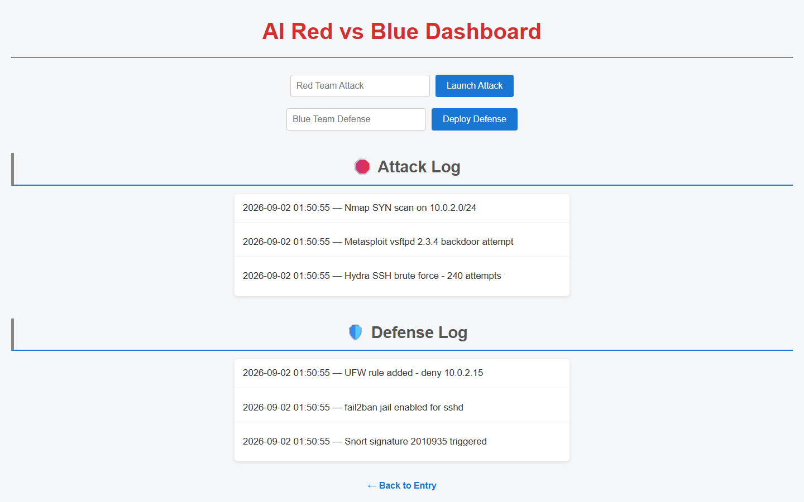
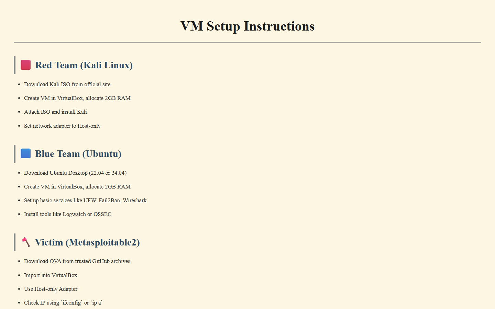
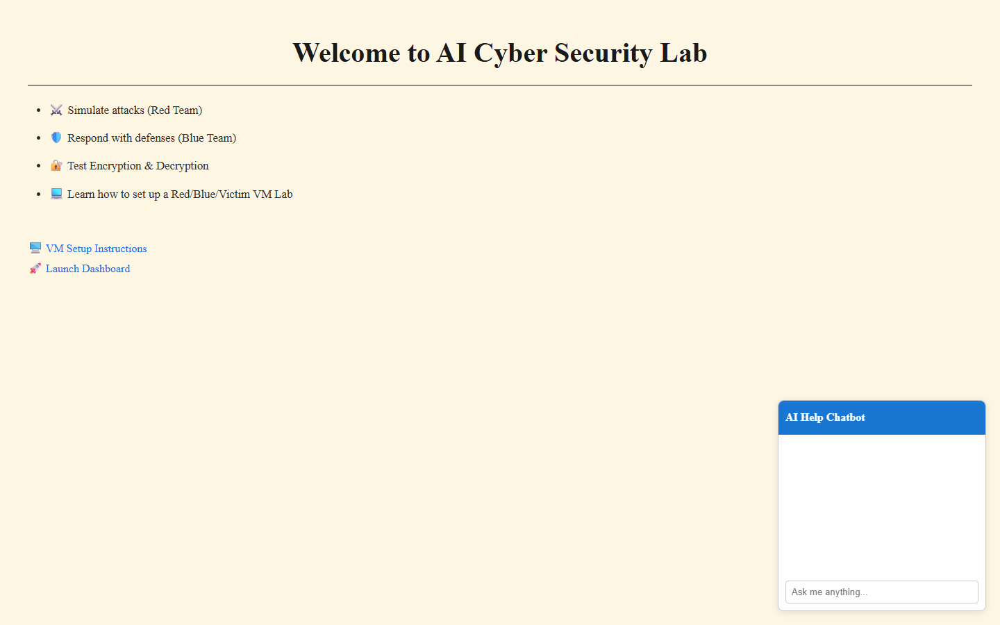

<div align="center">

# Cyber Security Lab — Red Team vs Blue Team

**A teaching dashboard for an offence/defence exercise, plus the VM range to run it on.**

[](https://www.python.org/)
[](https://flask.palletsprojects.com/)
[](https://www.kali.org/)
[](https://ubuntu.com/)
[]()

</div>



---

## What this is

A cybersecurity teaching aid in two halves:

1. **A VM range** — instructions for building a three-machine isolated lab where you can actually attack something.
2. **A scoreboard** — a Flask dashboard where each side logs what it did, so an exercise produces a shared, timestamped narrative instead of two people shouting across a room.

The dashboard deliberately does **not** perform attacks or defences. It records them. That separation is the pedagogy: students run real tools inside the isolated range, then write down what they did and what they observed, which is the habit that actually transfers to incident response.

---

## The VM range



Three machines on a host-only network, so nothing you do can reach the internet or the host:

| Role | Machine | Purpose |
|---|---|---|
| 🟥 **Red Team** | Kali Linux | Attack tooling |
| 🟦 **Blue Team** | Ubuntu | Monitoring, hardening, response |
| 🪓 **Victim** | Metasploitable 2 | Intentionally vulnerable target |

The `/vm-setup` page walks through the build: download the ISO, allocate 2 GB RAM, attach and install, and — the step that matters — **set the network adapter to Host-only**.

> [!IMPORTANT]
> Metasploitable 2 is intentionally riddled with vulnerabilities and must never be exposed to a network you do not control. Host-only networking is not a suggestion; it is the entire safety model of this lab.

---

## The dashboard



Three routes, and the whole app is about 40 lines:

| Route | Page |
|---|---|
| `/` | Entry — what the lab covers |
| `/vm-setup` | The three-VM build guide |
| `/dashboard` | The Red vs Blue event log |

Two forms post to `/attack` and `/defend`; each appends a `{time, event}` record and redirects back. The result is a single interleaved timeline of an exercise:

```
🛑 Attack Log
  01:50:55 — Nmap SYN scan on 10.0.2.0/24
  01:50:55 — Metasploit vsftpd 2.3.4 backdoor attempt
  01:50:55 — Hydra SSH brute force - 240 attempts

🛡️ Defense Log
  01:50:55 — UFW rule added - deny 10.0.2.15
  01:50:55 — fail2ban jail enabled for sshd
  01:50:55 — Snort signature 2010935 triggered
```

*(The entries above were posted while capturing the screenshot — the app ships with empty logs.)*

---

## Running it

```bash
pip install flask
python app.py
```

Opens on `http://127.0.0.1:5000`. No database, no configuration, no accounts.

---

## Design notes and limits

Worth being explicit about, since this is a teaching tool:

- **Logs are in-memory.** `attack_log` and `defense_log` are plain Python lists, so every restart wipes the exercise. Fine for a single session; the obvious first upgrade is SQLite.
- **No authentication.** Either side can post to either log. In a classroom that is the right trade; anywhere else it is not.
- **`debug=True` in `app.py`.** Convenient locally, and must not be used on any reachable host — the Werkzeug debugger allows arbitrary code execution.
- **`tools/redblue.py` is a stub.** An earlier encryption/decryption demo was removed and its import remains.

---

## Layout

```
app.py                    Flask app - 3 pages, 2 POST handlers
templates/
  entry.html                landing page
  vm_setup.html             three-VM build guide
  index.html                Red vs Blue dashboard
static/style.css
tools/redblue.py          stub
```

## Scope

Educational, for use inside an isolated lab you own. Nothing here is an attack tool — the repository contains a form, a list, and a set of instructions for building a practice range.
